# 控制理论-编程作业-2、5章

> 丁豪 南京大学 人工智能学院
>
> mail:181220010@smail.nju.edu.cn

## 2.1

- 第一问

```matlab
j=10.8e+8;k=10.8e+8;a=1;b=8;
num=k*[1 a];den=j*[1 b 0 0];
sys = tf(num,den);
sys = feedback(sys,[1],-1);
```

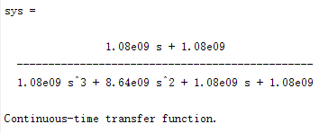

- 第二问

```matlab
t = [0:0.1:100];

in = 10*pi/180;
out = sys*in;
y = step(out,t);
plot(t,y*180/pi),grid;
xlabel('second');
ylabel('degree');
```

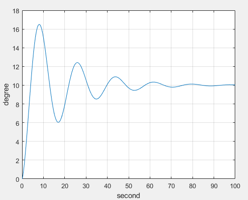

- 第三问

```matlab
j=10.8e+8*0.8;k=10.8e+8;a=1;b=8;
num=k*[1 a];den=j*[1 b 0 0];
sys = tf(num,den);
sys = feedback(sys,[1],-1);
in = 10*pi/180;
out = sys*in;
y1 = step(out,t);

j=10.8e+8*0.5;k=10.8e+8;a=1;b=8;
num=k*[1 a];den=j*[1 b 0 0];
sys = tf(num,den);
sys = feedback(sys,[1],-1);
in = 10*pi/180;
out = sys*in;
y2 = step(out,t);

plot(t,y*180/pi,t,y1*180/pi,t,y2*180/pi),grid;
xlabel('second');
ylabel('degree');
title('blue for 100%, red for 80%, yellow for 50%');
```

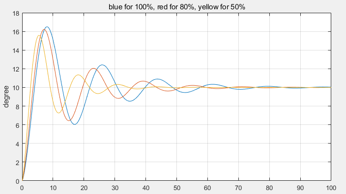

## 2.2

- 第一问

```matlab
sys1=tf([1],[1 0 0]);
sys1=feedback(sys1,[50],1);

sys2=tf([1],[1,1]);
sys3=tf([1 0],[1 0 2]);
sys4=series(sys2,sys3);
sys5=tf([4 2],[1,2,1]);
sys6=feedback(sys4,sys5,-1);

sys7=series(sys6,sys1);
sys8=tf([1 0 2],[1 0 0 14]);
sys9=feedback(sys7,sys8,-1);

sys10=tf([4],[1]);
sys11=series(sys10,sys9);
sys11 = minreal(sys11)
```

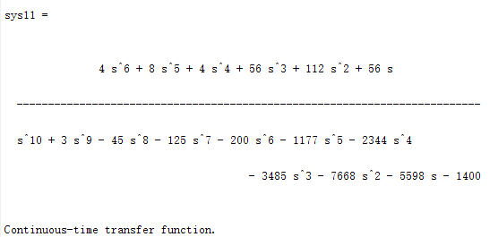

- 第二问

```matlab
pamap(sys11)
```

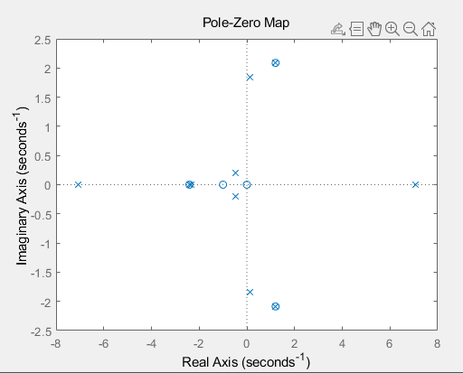

- 第三问

```matlab
p=pole(sys11)
z=zero(sys11)
```

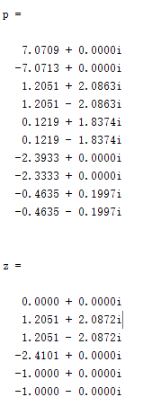

## 2.3

```matlab
z=5;
sys1=tf(20/z*[1 z],[1 3 20]);
z=10;
sys2=tf(20/z*[1 z],[1 3 20]);
z=15;
sys3=tf(20/z*[1 z],[1 3 20]);


t = [0:0.01:5];
y1=step(sys1,t);
y2=step(sys2,t);
y3=step(sys3,t);
plot(t,y1,t,y2,t,y3),grid
xlabel('second');
ylabel('output');
title('blue for 5, red for 10, yellow for 15');
```

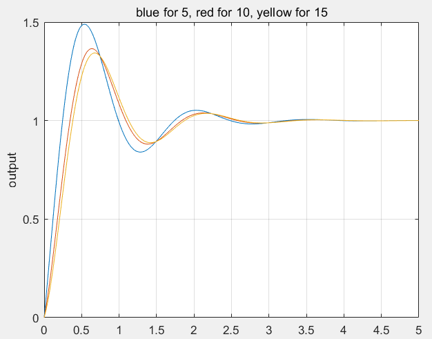

## 2.4

- 第一问

```matlab
g=tf([1,1],[1,2]);
h=tf([1],[1,1]);
sys=feedback(g,h,-1)
```

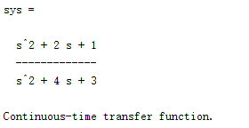

- 第二问：极点为-3、-1，零点为-1、-1

```matlab
pzmap(sys)
p=pole(sys)
z=zero(sys)
```

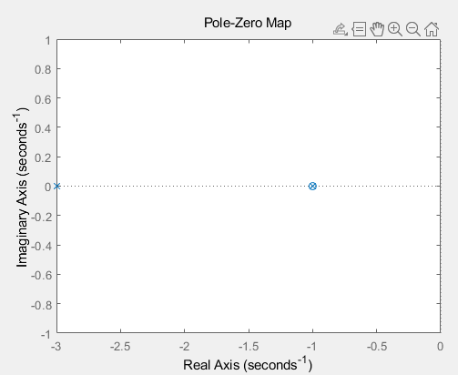

- 第三问：有，一个-1可以对消

```
sys=minreal(sys)
```

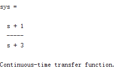

- 第四问：可以降低计算量，同时避免对于冗余极点、零点的特殊处理。


## 5.1

- $R(s)=1,Y(s)=\frac{15}{(s+3)(s+5)}$，由拉普拉斯反变换得$y(t)=\frac{15}2 e^{-3t} - \frac{15} 2 e^{-5t}$

```matlab
sys=tf([15],[1,8,15]);
t=[0:0.1:5];
y1 = impulse(sys,t);
y2 = 15/2*exp(-3*t)-15/2*exp(-5*t);
plot(t,y1,t,y2,'o'),grid
xlabel('seconds')
ylabel('output')
title('line for func:impulse, o for analytic solution');
```
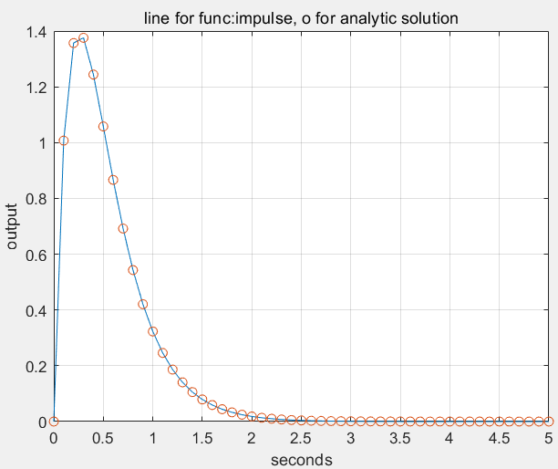

## 5.2

- 稳态误差$e_{ss}=\frac{\epsilon_{ss}}{H(0)}=\lim\limits_{s\rightarrow 0}\frac 1 {H(0)} \cdot \frac{sX_i(s)}{1+G(s)H(s)}=\lim\limits_{s\rightarrow 0}\frac{s}{s^2+\frac{s+10}{s+15}}=\lim\limits_{s\rightarrow 0}\frac s{10/15}=0$

```matlab
G=tf([1,10],[1,15,0,0]);
sys = feedback(G,[1],-1);
t = [0:0.1:50];
lsim(sys,t,t)
```
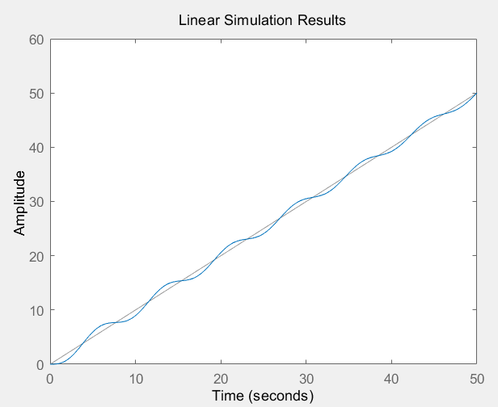

## 5.3

- 与5.17中的曲线加以比较
  - 图1中极点位于虚轴上，故呈现出幅度不变的周期函数
  - 图2中极点位于复平面第二象限，故呈现出振幅逐渐减小
  - 图3中极点位于虚轴上且更加靠近坐标原点，故幅度不变但相比1周期更长
  - 图4中极点位于复平面第二象限，但是在实部不变的情况下更靠近实轴，因此相比2震荡周期更长

```matlab
t=[0:0.01:20];

omega=2;xi=0;
sys=tf(omega*omega,[1,2*xi*omega,omega*omega]);
pole(sys)
y=impulse(sys,t);
subplot(221),plot(t,y),title('omega=2,xi=0')

omega=2;xi=0.1;
sys=tf(omega*omega,[1,2*xi*omega,omega*omega]);
pole(sys)
y=impulse(sys,t);
subplot(222),plot(t,y),title('omega=2,xi=0.1')

omega=1;xi=0;
sys=tf(omega*omega,[1,2*xi*omega,omega*omega]);
pole(sys)
y=impulse(sys,t);
subplot(223),plot(t,y),title('omega=1,xi=0')

omega=1;xi=0.2;
sys=tf(omega*omega,[1,2*xi*omega,omega*omega]);
pole(sys)
y=impulse(sys,t);
subplot(224),plot(t,y),title('omega=1,xi=0.2')
```

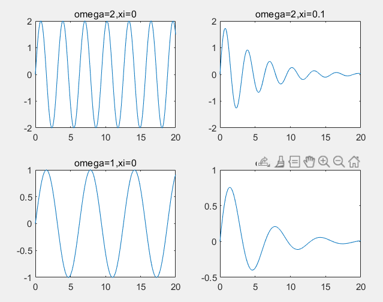

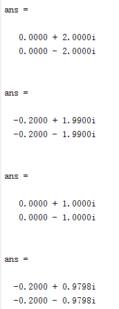

## 5.4

- 第一问：

  $\frac{Y(s)}{R(s)}=\frac{21}{s^2+2s+21}$

  $\therefore\omega_n=\sqrt{21},\xi=\frac{2}{\sqrt{21}}$

  $\therefore P.O. = e^{-\pi\xi\sqrt{1-\xi}}\approx 50\%$

- 第二问：由图像观察可得，超调量约为50%，与第一问结果相同


```matlab
sys1=tf(1,[1,2]);
sys2=tf(21,[1,0]);
sys=series(sys1,sys2);
sys=feedback(sys,1,-1);
t=[0:0.01:10];
step(sys,t)
```

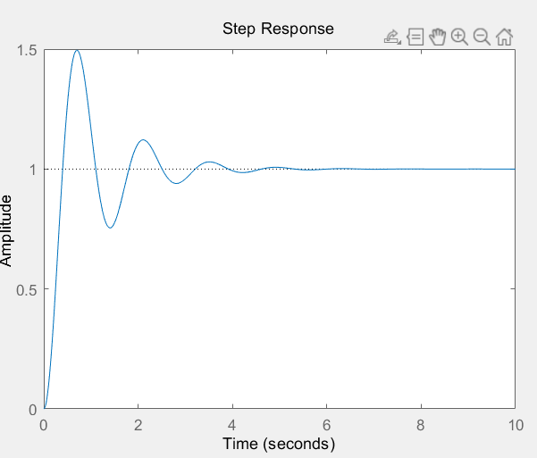

## 5.5

- 绘图如下，经过计算可得：$M_{pt}=0.163,T_p=0.726,T_s=1.62$


```matlab
L=tf(25,[1,5,0]);
sys=feedback(L,1,-1);
t=[0:0.001:3];
y = step(sys,t);
plot(t,y),grid

p=find(y==max(y));
Tp=t(p)
Mpt=(y(p)-1)/1
text(t(p),y(p),'o','color','red')
text(t(p),y(p),['     (',num2str(t(p)),',',num2str(y(p)),')'],'color','b')

p=find(abs(t-1.62)<1e-4);
text(t(p),y(p),'o','color','red')
text(t(p),y(p),['     (',num2str(t(p)),',',num2str(y(p)),')'],'color','b')
```

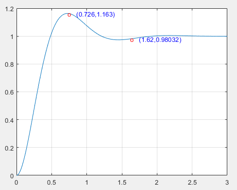

## 5.6

- 第一问

```matlab
sys1=tf([0.5,2],[1,0])
sys2=tf(1,[1,2,0])
sys=series(sys1,sys2)
sys=feedback(sys,1,-1)
```

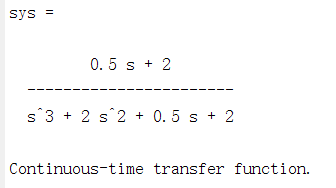

- 第二问：经过观察发现为发散震荡，选取模拟信号输入范围为[0,100]，以较好的反映这种发散性质。

```matlab
sys1=tf([0.5,2],[1,0])
sys2=tf(1,[1,2,0])
sys=series(sys1,sys2)
sys=feedback(sys,1,-1)
t=[0:0.1:100]
subplot(311),impulse(sys,t)
subplot(312),step(sys,t)
subplot(313),lsim(sys,t,t)
```

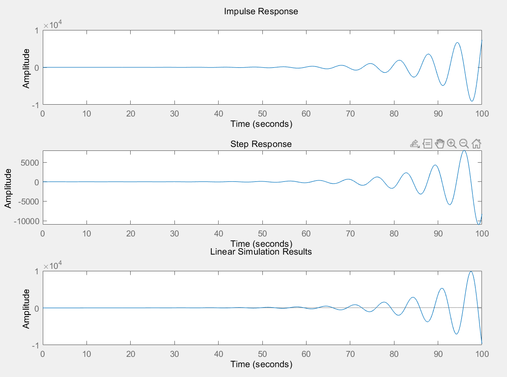

