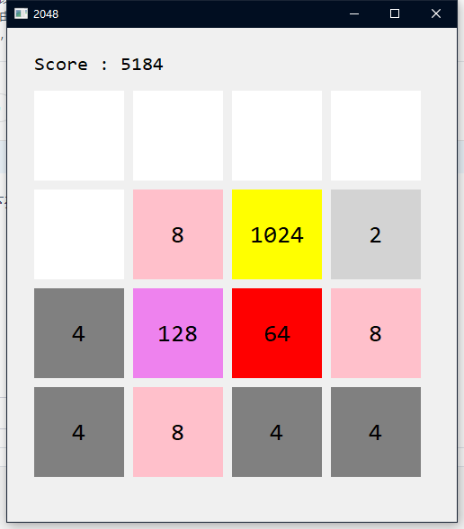
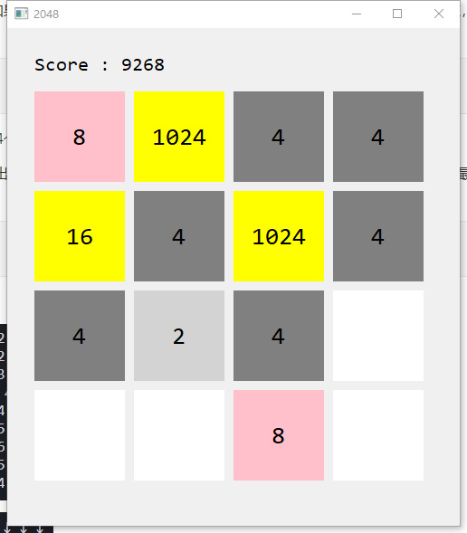
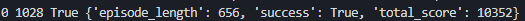
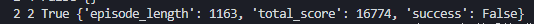

### 智能系统作业

人工智能学院   丁豪
181220010@smail.nju.edu.cn

***

#### 问题描述



​	问题为我们所熟悉的2048游戏，在4x4方格上可以采取上下左右四种行动，行动会将相同数字格子在当前方向合并，每次行动之后会在空余格子上生成一个新的2。由于框架代码已经给出了2048的原理和API，因此对问题进行建模这一步就可以省去了。我们要实现的算法要解决的问题是，如何在每一步产生一个较好的动作，使得整局游戏结束时得分尽可能高。这个实验的一个难点在于生成2的位置随机，也就是采取某个动作后下一状态未知，这给我们所熟悉的完全确定环境中的蒙特卡洛树搜索算法带来了一点困扰。


#### 算法描述

​	2048游戏原理实现与GUI都已经由框架代码实现，其中比较重要的接口有

```python
class Game2048Env(gym.Env):
class Game2048GUI(QMainWindow):
    
env = Game2048Env(True) # 创建2048游戏，选True开启GUI
env.reset() # 复位到初始状态
env.step(action) # env采取action行动，由0-3对应 上、下、左、右
env.state # 当前棋盘状态，为4*4列表，每一格的值即对应块上的数字
```

​	蒙特卡洛树相关部分我创了两个Class, 一个代表蒙特卡洛树节点，单纯记录一下**`棋盘状态`，`Q`，`N`，`子节点`**信息，并没有方法。另一个代表一棵蒙特卡洛树，他的内部方法为经典的蒙特卡洛树搜索之**选择、展开、评价、反向更新**，在此基础上使用外部接口get_action来获得一个动作，在此函数中，首先会根据当前真实环境状态创建根节点，然后在给定时间（1秒）内不断进行如上4步来扩展蒙特卡洛树，最终根据根节点4个方向的Q值，选取最优行动予以返回。

​	**选择、展开** 两步合一，调用函数\_UCT()来选择行动，并把对应行动的子节点进行展开。内部方法_UCT（）用来计算每个节点的价值与探索奖赏加权和，在子节点探索次数为0时会直接返回一个很大的数，当作无穷大来使用。具体公式为$UCT = Q + c\sqrt{\frac{\log N(s)}{N(s,a)}}$.

​	**评价** 这一步中使用的rollout方法为均匀随机，深度由参数rollout_depth控制，在达到指定深度后直接读取当前得分作为评价指标。

​	**反向更新** 这一步中，沿着父节点一路向上直到根节点，沿路更新Q和N，其中Q值维护的是“平均最终得分” 而不是 “平均增加得分”，因为我觉得这样输出看起来更有物理意义方便诊断。具体的更新公式为$Q \leftarrow Q + \frac{1}{N}(R-Q),\ N \leftarrow N+1$.

```python
bignumber = 1e20
c = 100
rollout_depth = 10

class MCTnode():
    def __init__(self,s):
        self.state = s
        # 假设没有先验知识
        self.Q = 0.0
        self.N = 0
        self.child = [None,None,None,None]
        self.father = None
class MCT():
    def __init__(self,s,env):
        self.root = MCTnode(s)
        self.env = copy.deepcopy(env)
        
    def _UCT(self,node,action):
        if node.child[action] == None:
            return bignumber
        else:
            return node.child[action].Q + c*math.sqrt(math.log(node.N)/node.child[action].N)
    
    def _select_expand(self):
        # 略
    def _evaluate(self,node,env):
    	# 略
    def _backup(self,node,value):
        # 略
        
    def get_action(self,s,env):
        # 每次搜索重置整颗搜索树，以真实状态作为新的根节点
        self.root = MCTnode(s)
        self.env = copy.deepcopy(env)
        allow_time = 1000
        start_time = time.time() * 1000
        mean_search_time = 0
        n = 0
        while allow_time - time.time()*1000 + start_time > 2 * mean_search_time:
            new_node, new_env = self._select_expand()
            value = self._evaluate(new_node, new_env)
            self._backup(new_node,value)

            n+=1
            mean_search_time = (time.time()*1000.0 - start_time)/n
            
        # 略

        return action
```


#### 实验

​	一开始实验时，复用了原先搜索过的节点，结果发现由于随机出的2不一样，模拟状态中的节点信息与真实状态很快就大相径庭，再无任何参考价值，于是效果非常差。改进之后在每一次get_action操作的时候，将当前真实状态值重新设置为根节点，并由此开始搜索。这样虽然仍然不能避免搜索过程中产生的情况可能和真实情况有差别，但是在期望意义上搜索出的结果应当也是真实状态下最优的结果，并且每一步走完之后都会进行同步，所以搜索状态的差异和真实状态的差异被控制在一步之内，效果就非常逼真，可以接受了。

​	在数次尝试中，不断修改探索奖励系数c以及rollout深度，最终确定为上述代码中的样子。

​	当实验进行到快要产生2048时，发生了列表越界错误而终止，推测是框架代码只设置到2048。


​	于是对框架代码进行了简单修改，增加了分数条上限，以及对应颜色，但是并未修改终止条件（2048还是会赢）	

```python
# Game2048Env
for num in range(1, 20):
            self.score_dict[2 ** num] = 2 ** (num - 1)

# Game2048GUI
col = ['lightgrey','grey', 'pink', 'yellow', 'brown', 'red', 'violet', 'crimson', 'fuchsia', 'yellow', 'yellow', 'yellow', 'yellow', 'yellow', 'yellow', 'yellow', 'yellow', 'yellow', 'yellow'] * 100
```

​	总共进行了5次游戏，都可以运行到2048，而且看起来尚有余力。





​	于是进一步修改了一下游戏停止规则，得到了更高的分数。

```python
if self.state[i][j] == 2048*2048:
                    self.done = True
                    self.info['episode_length'] = self.episode_length
                    self.info['success'] = True
                    self.info['total_score'] = self.score
```

