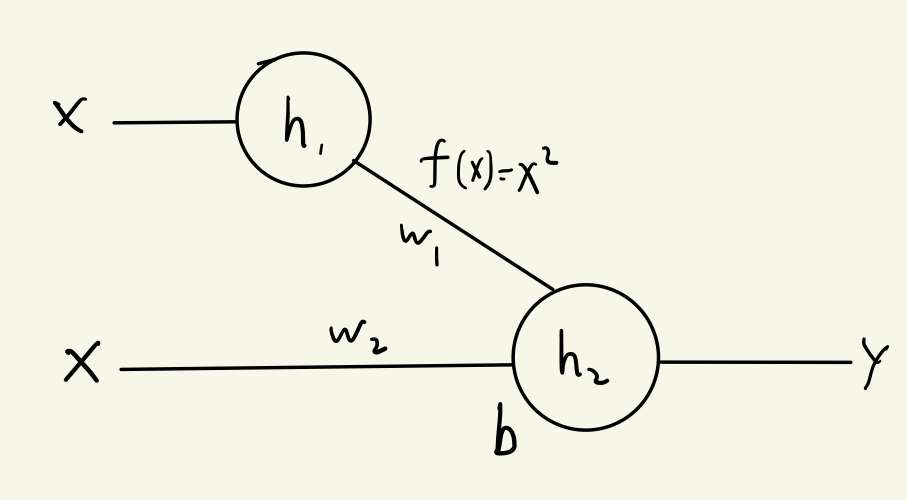

### 神经网络-第四讲作业
> 丁豪 人工智能
> 181220010@smail.nju.edu.cn

---

### 第一题

​	如下函数不适合作为激活函数，因为虽然此函数为非线性函数，解决了神经网络无法拟合非线性函数的问题。然而其在0点出发生了函数值的突变，在0点处不连续不可导，因而难以使用梯度下降等方法来训练神经网络。

### 第二题

- relu函数为:$f(x)=max(0,x)$，导数为$f'(x)=\begin{cases} 0 &,x<0 \\ 1 &,x\ge0\end{cases}$

- sigmoid函数为:$g(x)=\frac1{1+e^{-x}}$，导数为$g'(x)=g(x)(1-g(x))$

- $h_1=f(w_1i_1+w_3i_2+b_1),h_2=f(w_2i_1+w_4i_2+b_2)，Y_i'=g(w_5h_1+w_6h_2)$

- $\frac{\part E}{\part w_1}=2\sum\limits_{i=1\dots n}(Y_i'-Y_i)\frac{\part Y_i'}{\part w_1}$

  $=2\sum\limits_{i=1\dots n}(Y_i'-Y_i)\frac{\part g(w_5h_1+w_6h_2)}{\part(w_5h_1+w_6h_2)}\cdot \frac{\part(w_5h_1+w_6h_2)}{\part w_1}$

  $=2\sum\limits_{i=1\dots n}(Y_i'-Y_i)g'(w_5h_1+w_6h_2)\cdot[w_5i_1f'(w_1i_1+w_3i_2+b_1)]$
  
  将上述$Y_i',g,h_1,h_2,f$带入即得展开式
  
- $\frac{\part E}{\part b_2}=2\sum\limits_{i=1\dots n}(Y_i'-Y_i)\frac{\part Y_i'}{\part b_2}$

  $=2\sum\limits_{i=1\dots n}(Y_i'-Y_i)g'(w_5h_1+w_6h_2)\cdot\frac{\part(w_5h_1+w_6h_2)}{\part b_2}$

  $=2\sum\limits_{i=1\dots n}(Y_i'-Y_i)g'(w_5h_1+w_6h_2)\cdot[w_6f'(w_2i_1+w_4i_2+b_2)]$

  将上述$Y_i',g,h_1,h_2,f$带入即得展开式

- $\frac{\part E}{\part w_5}=2\sum\limits_{i=1\dots n}(Y_i'-Y_i)\frac{\part Y_i'}{\part w_5}$

  $=2\sum\limits_{i=1\dots n}(Y_i'-Y_i)g'(w_5h_1+w_6h_2)\cdot h_1$

  将上述$Y_i',g,h_1$带入即得展开式

- 当具体数据如题目所示时

  $\frac{\part E}{\part w_3}=2\sum\limits_{i=1\dots n}(Y_i'-Y_i)\cdot g'(w_5h_1+w_6h_2)\cdot[w_5i_2f'(w_1i_1+w_3i_2+b_1)]$

  $=2(0.99-5.6)\cdot 0.00918 \cdot 9.8 \approx -0.83$

### 第三题

- 设我们要拟合的二次曲线为$y=ax^2+bx+c$，或者可以写作$y=a(x+b)^2+c$

- 单一感知器神经元无法拟合二次曲线。因为其输出位$y=f(wx+b),f$为激活函数，其自由度只有二维（$w,b$），而我们要拟合的二次曲线自由度有三维（$a,b,c$），因而一定不能用单一神经元拟合任意二次曲线。

- 至少需要两个感知器神经元来拟合二次曲线，实现方法如下。

  - $h_1$：输入一维，对输入$x$直接经过激活函数$f(x)=x^2$后输出。
  - $h_2$：输入二维，对输入$h_1,x$乘上权重向量$w$加上偏执$bias$，直接输出。
  - 当$w=\begin{pmatrix}a \\ b\end{pmatrix},bias=c$ 的时候，这两个神经元就可以完全表示$y=ax^2+bx+c$

  