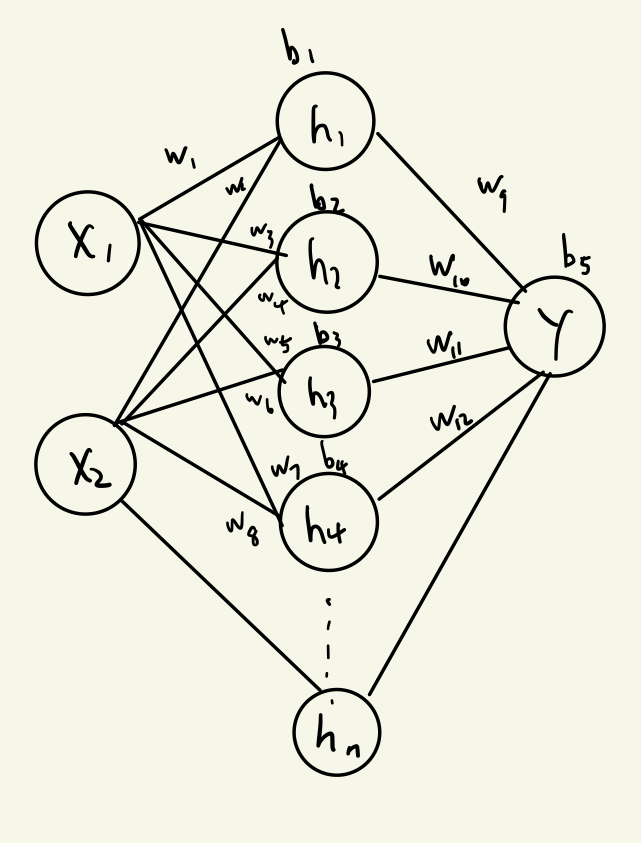
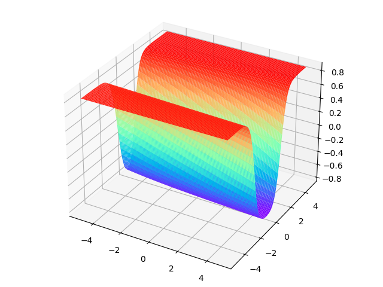
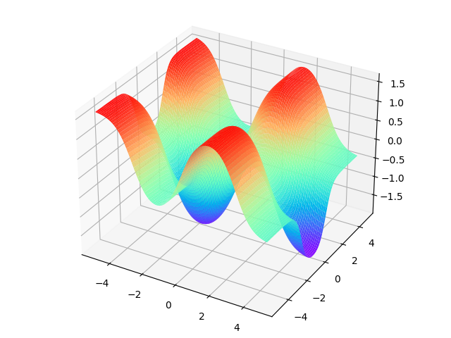
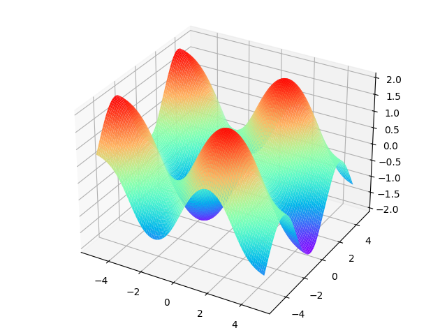
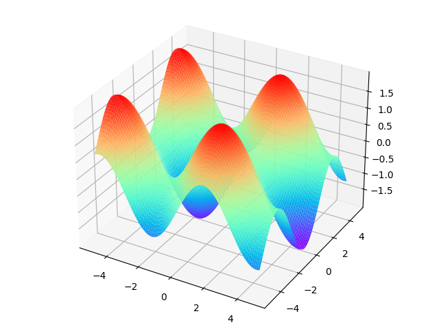

## 神经网络—大作业1：实现多层感知器网络

> 丁豪  南京大学人工智能学院
> 181220010@smail.nju.edu.cn

### 网络设计

- 网络结构为单隐层神经网络。输入层2个神经元，分别对应$X_1,X_2$。输出层1个神经元，其输出为拟合值。隐层神经元数量可以通过在创建MLP对象时指定`n_hidden`参数调整。

- 激活函数：隐层神经元使用sigmoid函数激活，输出层无激活
  
  - sigmoid函数的表达式为:$f(x)=\frac{1}{1+e^{-x}}$
  
- 损失函数：使用MSE损失，公式为$\frac 1 {2m} \sum\limits_{i=1 \dots m} (\hat y_i-y_i)^2$




### 编程实现

- 训练数据生成：使用`np.random.uniform(-5,5)`产生$x_1,x_2$，然后$y=sin(x_1)-cos(x_2)$

- MLP网络封装成MLP对象，在创建时可以指定唯一参数`n_hidden`用于控制隐层神经元数量。

  ```python
  def __init__(self, n_hidden):
          self.hidden = n_hidden
          self.w = np.random.normal(size = 2*self.hidden + 1*self.hidden )
          self.b = np.random.normal(size = self.hidden + 1)
          print("created MLP of size: 2 x %d x 1" % self.hidden)
  ```

- 前向传播：从输入逐层向前求解网络输出值

- 反向传播：从Error出发，逐层向前求梯度，最终基于学习率与梯度进行各参数更新。

  - 定义batch_size参数，每一轮学习后降低学习率，来更好的收敛到最优参数值

  ```python
  learn_rate = 0.1 # 初始学习率
  decay = 0.8 # 使用衰减系数来控制learn_rate
  batch_size = 10000 # 每一轮学习的样本数
  ```


### 实验结果

- 训练集100w，隐层12个神经元的情况下，1w条测试集上的mse为：0.000798
- 随着隐层神经元的增多，拟合的细节相应增多，拟合精度也逐渐提升。图1为2个隐层神经元，图2为5个隐层神经元，图3为12个隐层神经元，图4为数据的真实分布。可以发现神经元越多拟合结果越接近真实。

<center>
<figure>




</figure>
</center>


### 总结

- 此MLP可以拟合此函数的原因主要有以下方面
  - 输出层使用线性加权和+偏执，并未使用任何激活函数。因而值域可以达到$\mathbb R$。
  - 隐层采用sigmoid激活函数，消除了输入的线性，对于非线性的三角函数具有了拟合能力。

- 当采用relu函数时，训练效果并不好。这主要是因为在单隐层情况下，relu函数本身与线性函数差异不大。因而很容易发生拟合效果差或者梯度爆炸无法收敛的现象。
- 当隐层神经元较多（>20）时，会出现无法收敛的梯度爆炸现象。具体原因还需要进一步研究。