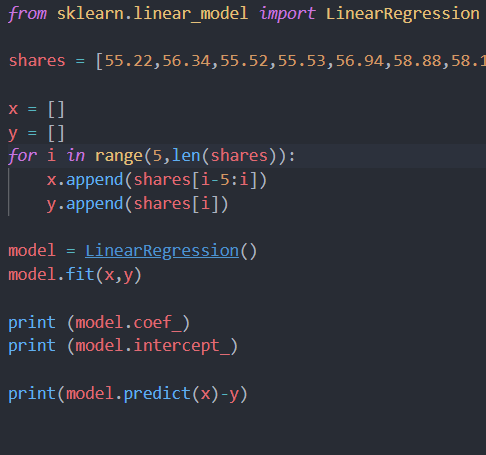
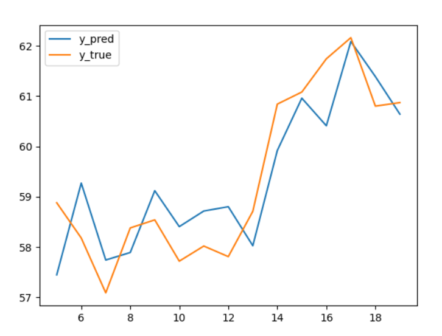

### 第一题

- 使用线性回归模型，以前5天的股票价格作为输入，预测当天股价。即$y=w^Tx+b$，其中$w \in R^5$

  

- 经过求解得到线性拟合的结果为$w=(0.33537424,-0.52427529,0.78756728,-0.81451611,1.1125442), b=6.622241295927424$

- 模型评价：该模型从第6天开始的预测值与真实值的差异（绝对值）如下图所示

  ```
  [1.43214063 1.09112795 0.65240599 0.4880998  0.57939131 0.68584299
   0.69589406 0.99169825 0.68334731 0.92117335 0.12219731 1.33058539
   0.07654813 0.58728639 0.229555  ]
  ```

  

### 第二题

#### 方法一：贝叶斯公式求毕式解

- 我们将x看做一个7维向量，则其与真实状态的“误差”可以用其和真实值得内积来度量。例如，若x与2的真实值(1,-1,1,1,1,-1,1)完全相同，则其内积应当为7，若存在k个差异，则内积相应减少2k。因而x与真实值得差异可以由如下$E(x|\cdot)$来刻画。

  $E(x|s=2)=7-\frac 1 2\langle x,(1,-1,1,1,1,-1,1)\rangle $

  $E(x|s=3)=7-\frac 1 2\langle x,(1,-1,1,1,-1,1,1)\rangle $

- 由伯努利分布公式可知

  $P(x|s=2)=0.1^{E(x|s=2)}\cdot 0.9^{7-E(x|s=2)}$

  $P(x|s=3)=0.1^{E(x|s=3)}\cdot 0.9^{7-E(x|s=3)}$

- 由贝叶斯公式可知$P(s=2|x)=\frac{P(x|s=2)P(s=2)}{P(x)},P(s=3|x)=\frac{P(x|s=3)P(s=3)}{P(x)}$

  我们假设2和3出现的概率相等，即$P(s=2)=P(s=3)=0.5$

  又由于s只为2或3，因而$P(s=2|x)+P(s=3|x)=1$

  所以$P(s=2|x)=\frac{P(x|s=2)}{P(x|s=2)+P(x|s=3)}$，将上述$P(x|s=2),P(x|s=3)$带入即可

- 当x为2的真实值(1,-1,1,1,1,-1,1)时，$P(s=2|x)=\frac{81}{82}=0.9878$

#### 方法二：单神经元拟合

- 采用单一神经元，线性加权和后加上偏执，最终经过sigmoid激活，即$P(s=2|x)=\frac{1}{1+e^{-(w^Tx+b)}}$

- 假设2和3出现概率相等，随机生成样本进行梯度下降训练，采用折扣因子逐渐降低学习率。

  

- 最终训练得到权重向量w和偏执b如下，在x显示为2时预测真实值是2和3的概率如下，与方法一中贝叶斯求得的结果基本相同，证明本方法训练得到的神经元收敛到真实值。

  